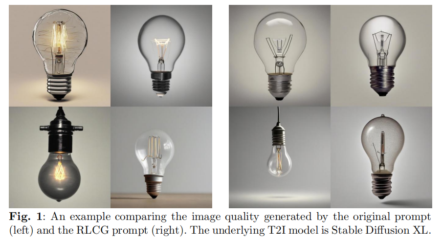
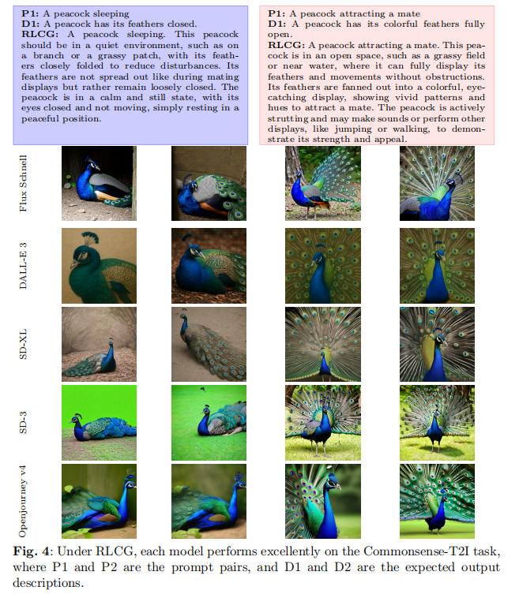
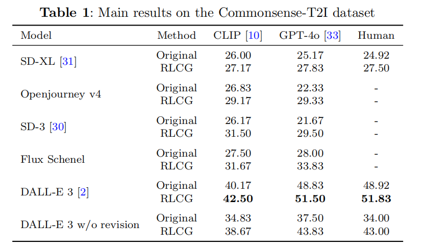

# 🧠 RLCG: Counterfactual-Guided Reinforcement Learning for Prompt Optimization  
### *Enhancing Text-to-Image Consistency through Commonsense Reasoning*

本项目是论文Counterfactual-Guided Reinforcement Learning Framework for Prompt Optimization: Enhancing Text-to-Image Consistency的配套实现，提出了一种**基于反事实推理与强化学习相结合的提示词优化框架（RLCG）**，以提升文本到图像生成任务中的**语义一致性与常识合理性**。

---

## ✨ 项目简介

现有 T2I（Text-to-Image）生成模型如 Stable Diffusion 和 DALL·E 3 在视觉表现方面已取得显著成果，但在面对涉及常识推理或反事实描述的复杂提示词时，往往生成出不合理的图像。

为解决此问题，RLCG 提出：
- 💡 利用大型语言模型（如 GLM4）自动构造**反事实问题与答案**，以丰富原始 prompt；
- 🔁 使用 Proximal Policy Optimization (PPO) 强化学习算法**优化提示词策略**；
- 📈 构建兼顾**语义相似性与多样性**的奖励函数，驱动提示词向常识一致方向演化；
- 🧠 显著提升图像在 CLIP/GPT-4o/Human 评估指标上的**常识合理性与语义对齐度**。

---

## 🖼️ 示例图像

下图展示了本项目通过 RLCG 提示词优化后生成的图像示例：

<p align="center">
  
</p>

---

## 📁 项目结构

```
RLCG/
├── generate_images.py       # 主程序：反事实构造 + PPO优化 + 图像生成
├── evaluate.py              # 图像一致性评估：CLIP、GPT-4o、规则对比等
├── datasets/                # 原始与优化提示词
│   └── captions.json
├── examples/                # 生成图像结果
│   ├── original/
│   └── optimized/
├── requirements.txt         # 项目依赖
└── README.md
```

---

## 🚀 快速开始

### 1️⃣ 安装依赖

```bash
pip install -r requirements.txt
```

### 2️⃣ 使用原始或优化提示词生成图像

```bash
python generate_images.py \
    --prompt_file datasets/captions.json \
    --output_dir examples/optimized \
    --model stable-diffusion-xl
```

参数说明：
- `--model` 指定图像生成模型（如 `stable-diffusion-xl`）

---

## 📐 图像一致性评估

使用 `evaluate.py` 对生成图像进行语义一致性和常识性评估：

```bash
python evaluate.py \
    --image_dir examples/optimized \
    --prompt_file datasets/optimized_prompts.json \
    --method clip
```

支持以下评估方式：
- `--method clip`：使用 CLIPScore 打分
- `--method gpt4o`：调用 GPT-4o 判断图像与描述是否匹配（需 API 支持）
- `--method rule`：基于论文中的正负样本规则计算准确率（Commonsense-T2I 格式）

---

---

## 🎯 核心方法组件

### 🔎 反事实推理模块（Counterfactual Module）

基于 GLM4 自动构造三类问题以补全语义盲点：
- ✅ **场景类问题**（e.g. “如果一只熊在吃鲑鱼，它应该在哪？”）
- ✅ **对象属性类问题**（e.g. “没有电的灯泡应呈现什么状态？”）
- ✅ **行为逻辑类问题**（e.g. “孔雀在求偶时会如何表现？”）

最终生成结构化 **增强提示词**，更贴近真实常识语境。

### 🎯 强化学习优化模块（RL Optimization）

基于 PPO 进行提示词策略优化：
- 构建奖励函数：  
  \( R_{\text{total}} = (1 - \alpha) \cdot R_{\text{semantic}} + \alpha \cdot R_{\text{diversity}} \)
- 使用向量余弦相似度衡量语义一致性与多样性
- 多轮采样并选择最高得分提示词用于更新

---

## 🖼️ 示例图像
<p align="center">
  
</p>

---

## 📊 实验结果（Commonsense-T2I）

<p align="center">
  
</p>

> 🎯 在多个 T2I 模型中均显著提升图像常识性与语义一致性

---

## 🧪 数据集与评估工具

- 📦 使用 [Commonsense-T2I 数据集](https://huggingface.co/datasets/CommonsenseT2I)
- 📐 指标支持：CLIPScore、GPT-4o 打分、人工一致性评估
- 🤖 支持自动对比图像与两个描述的匹配性、歧义容错等评测逻辑

---

## 📄 引用本项目

如果您在研究中使用了本项目的代码或思想，欢迎参考以下引用格式：

> Dong R., Ning Y., Li F.  
> *Counterfactual-Guided Reinforcement Learning Framework for Prompt Optimization: Enhancing Text-to-Image Consistency*  
> Manuscript in preparation, 2025.


---

## 🙏 致谢（Acknowledgements）

本项目构建过程中参考并使用了以下开源模型、工具和数据集，特此致谢：

- 🖼 **Stable Diffusion XL (SD-XL)** & **Stable Diffusion 3 (SD-3)**  
  高质量文本到图像生成模型，由 Stability AI 发布。

- 🎨 **Openjourney v4**  
  基于 Midjourney 风格调优的 Stable Diffusion 模型，由 PromptHero 社区提供。

- 🧪 **Flux Schnell**  
  来自 Black Forest Labs 的文本图像生成模型，用于风格对比实验。

- 🌌 **DALL·E 3**  
  OpenAI 发布的最新文本图像生成系统，用于对比原始与优化提示词生成效果。

- 📐 **CLIPScore**  
  图文语义相似度评估指标，用于自动评估图像与提示词的一致性。

- 🧠 **GLM4-Plus**  
  由清华大学和智谱 AI 联合开发的大型语言模型，用于反事实问题生成与推理。

- 📊 **Commonsense-T2I Dataset**  
  来自 UIUC & UPenn 的开放数据集，专用于评估 T2I 模型的常识理解能力。  
  📍 [https://huggingface.co/datasets/CommonsenseT2I](https://huggingface.co/datasets/CommonsenseT2I)

我们特别感谢上述开源项目提供了强大的基础与评估支持，使本研究得以顺利进行。

---

## 🪪 License

本项目采用 [MIT License](https://opensource.org/licenses/MIT) 进行开源发布。  
允许自由用于研究、教学与商业应用，惟须保留作者署名与原始声明。  
如果本项目对您的研究有帮助，请在论文或代码中引用本仓库。

